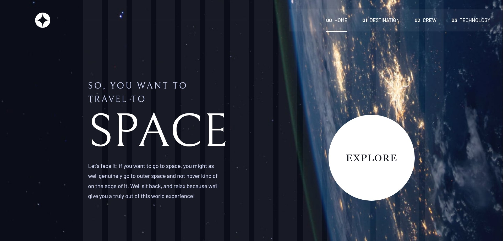
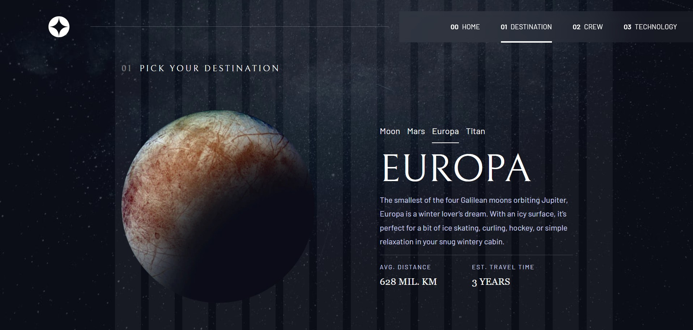
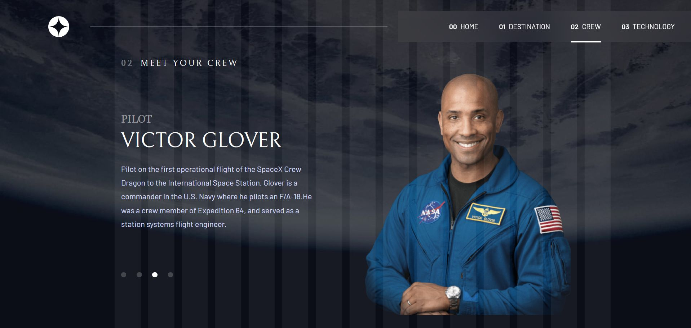
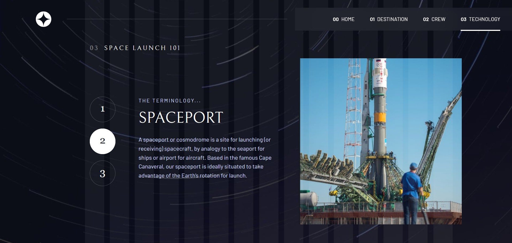

# 🚀 Space Tourism Website

A modern, fully responsive space tourism website built with **React**, **Vite**, and **Tailwind CSS**. This project is a solution for the Frontend Mentor Space Tourism challenge and emphasizes reusable components, semantic HTML, accessibility, and responsive design across mobile, tablet, and desktop devices.

# 📑 Table of Contents

- [Live Demo](#-live-demo)
- [Preview](#-preview)
- [Features](#-features)
- [Built With](#-built-with)
- [Pages](#-pages)
- [Responsive Design](#-responsive-design)
- [Accessibility](#-accessibility)
- [What I Learned](#-what-i-learned)
- [Future Improvements](#-future-improvements)
- [Author](#-author)

---

## 🌐 Live Demo

**Website:** https://your-live-site.com

## 📸 Preview

### Home

### Destination

### Crew

### Technology

---

# ✨ Features

- Fully responsive layouts for mobile, tablet, and desktop
- Dynamic background images for every page
- Interactive page navigation with React Router
- Dynamic destination, crew, and technology content
- Responsive portrait and landscape images
- Reusable custom React hooks
- Clean component architecture
- Semantic HTML throughout the application
- Keyboard accessible controls
- Optimized for accessibility
- Fast development with Vite

---

# 🛠 Built With

- React
- Vite
- Tailwind CSS
- React Router
- JavaScript (ES6+)

---

# 📄 Pages

## 🏠 Home

- Hero landing page
- Responsive background images
- Explore call-to-action

## 🌕 Destination

- Browse destinations
- Interactive destination selector
- Planet information
- Average distance
- Estimated travel time

## 👨‍🚀 Crew

- Meet each crew member
- Interactive crew navigation
- Dynamic biographies
- Responsive imagery

## 🚀 Technology

- Explore launch technology
- Numbered navigation controls
- Portrait and landscape images
- Dynamic technology descriptions

---

# 📱 Responsive Design

The website automatically serves different assets depending on the viewport.

| Device  | Background | Technology Image |
| ------- | ---------- | ---------------- |
| Mobile  | Mobile     | Landscape        |
| Tablet  | Tablet     | Landscape        |
| Desktop | Desktop    | Portrait         |

---

# ♿ Accessibility

Accessibility was considered throughout development.

- Semantic HTML5 elements
- Proper heading hierarchy
- Keyboard accessible navigation
- Visible focus states
- Descriptive image alt text
- ARIA labels where appropriate
- Accessible interactive controls

---

# 📚 What I Learned

This project helped strengthen my understanding of:

- Component composition in React
- State management with hooks
- Responsive UI development
- React Router
- Tailwind CSS utility workflow
- Custom React hooks
- Semantic HTML
- Web accessibility
- Clean project organization

---

# 🔮 Future Improvements

- Animated page transitions
- Lazy-loaded images
- Loading skeletons
- Theme customization
- Unit testing
- End-to-end testing
- Performance optimization

---

# 👤 Author

**Muneeb**

GitHub: https://github.com/mmuneeb1000

Portfolio: https://cute-madeleine-e3573d.netlify.app/

LinkedIn: https://www.linkedin.com/in/m-muneeb-a9984633b/
